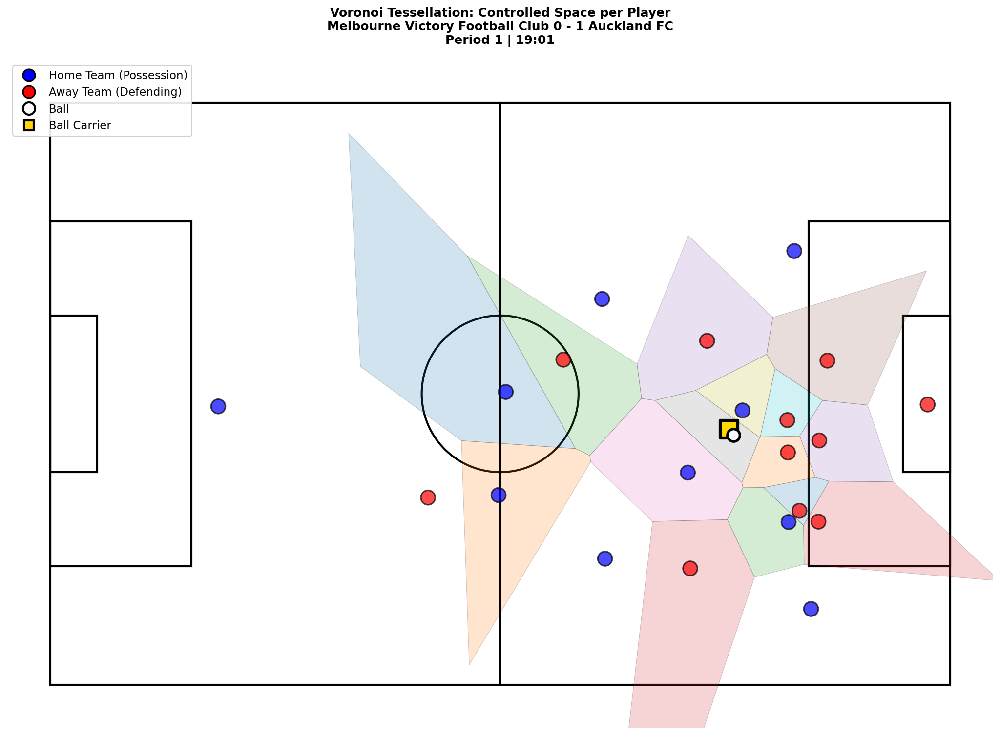
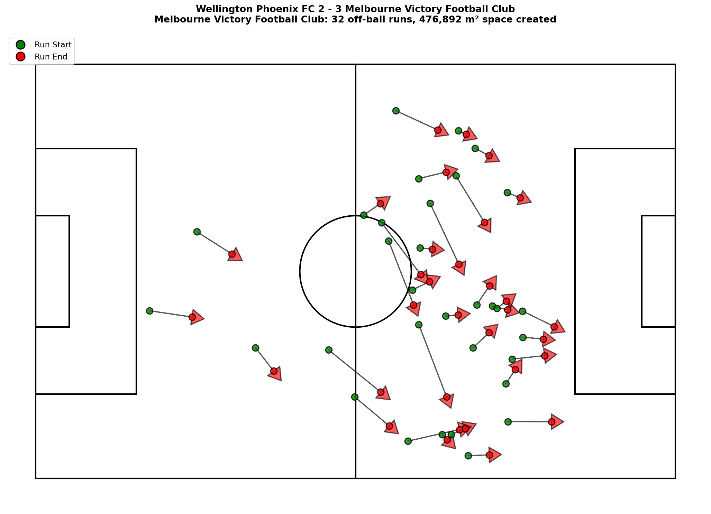

# Off-Ball Run Analysis: Quantifying Space Creation in Football

**Author:** Ivo Steinke  
**Competition:** PySport X SkillCorner Analytics Cup

---

## Research Track Abstract

### Introduction

Off-ball movement is crucial to modern football tactics, yet traditional analysis focuses primarily on players in possession. This work quantifies how high speed off-ball runs create exploitable space for the ball carrier during team possession.

The methodology analyzes 10 A-League matches using SkillCorner's broadcast tracking data, combining velocity based run detection with Voronoi tessellation. This transparency first approach provides interpretable metrics without relying on black box machine learning.

### Methods

**Data:** 10 A-League matches (2024/25 season) containing 688,000+ player position frames at 10 Hz during own team possession phases.

**Run Detection:** High speed off-ball movements identified using velocity threshold ≥5.0 m/s (18 km/h), minimum duration 3 seconds, own team in possession.

**Space Measurement:** Voronoi diagrams calculated at run start (t₀) and end (t₀+3s) for the ball carrier:
```
Space_Created = Voronoi_Area(ball_carrier, t₀+3s) - Voronoi_Area(ball_carrier, t₀)
```

**Normalization:** All runs normalized to left to right attack direction accounting for halftime side switches.



*Figure 1: Voronoi tessellation showing controlled space. Ball carrier (gold square) gains space when teammates pull defenders away.*

### Results

Across 10 matches, **855 distinct off-ball runs** were detected (average 85.5 runs/match).

**Overall Metrics:**
- Average space change: **-127 m²** per run  
- Net space effect: **-108,823 m²** across all runs

**Positive Space Runs (412 runs, 48.2%):**
- Average space change: **434 m²** per run  
- Net space effect: **178,639 m²**

**Interpretation:** Most off-ball runs occur in congested areas where defenders close down space faster than runs can create separation. However, 48.2% demonstrate positive space creation (434 m² average), revealing that effective space creation requires coordinated timing rather than high volume running.

**Top Performers:**
1. Most Runs/Match: Ivan Vujica (Macarthur FC) at 11.0 runs/match
2. Most Space/Match: Joshua Rawlins (Melbourne Victory FC) at 9,445 m²/match
3. Most Efficient: Corban Piper (Wellington Phoenix FC) at 1,094 m²/run (min. 5 runs)



*Figure 2: All off-ball runs from Melbourne Victory showing normalized trajectories. Green markers indicate run start, red markers show run end.*

### Conclusion

This Voronoi based approach quantifies off-ball run effectiveness using broadcast tracking data. While high speed movements are frequent (85.5 per match), 48.2% create positive space within the measurement window.

**Limitations:** The methodology uses strict detection criteria (≥5.0 m/s or 18 km/h sustained for 3 seconds), which may exclude lower intensity runs. The 3 second measurement window may be too short to capture delayed defensive reactions.

**Impact:** This interpretable framework enables coaches to distinguish between high volume running and tactically effective movements that create exploitable space, providing actionable insights for tactical preparation.

---

## Quick Start
```python
from src.data_loader import load_matches_info, load_match_data
from src.space_analysis import analyze_all_matches_normalized

MATCH_IDS = ['2017461', '1996435', '1886347', '1899585', '1925299',
             '1953632', '2006229', '2011166', '2013725', '2015213']

matches = load_matches_info(MATCH_IDS)
trajectories = analyze_all_matches_normalized(matches, load_match_data, velocity_threshold=5.0)

print(f"Detected {len(trajectories)} runs")
```

## License

MIT License - See LICENSE file for details
